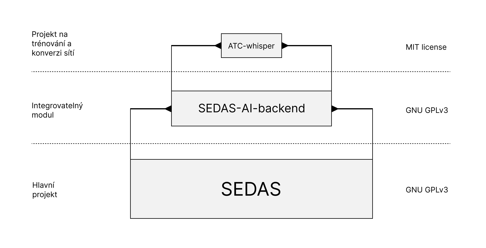

===================
Technické pozadí
===================

Tabulka obsahů
===================================
#. :ref:`Technologies`
#. :ref:`Project`
#. :ref:`Schematic`
#. :ref:`Neural networks`
#. :ref:`Calculations`

.. _Technologies:
Použité technologie
============

Samotná aplikace používá mnoho technologií k implementaci mnoha jejích částí. Například používá lokální komunikaci souborů pro komunikaci mezi hlavním aplikací a modulem AI. Tato stránka se pokusí vysvětlit všechny technické přístupy, které byly použity v rozvoji.

.. list-table:: List of used technologies
:widths: 40 60

• Použité technologie *
* vysvětlení *
• • • • • • • •
-
• „Elektronika“
Hlavní záloha pro chování aplikací
• „NodeJS“
Hlavní kód runtime
• „Typický“
Jazyk používaný pro backend
* - „Node-addon-api / C++“
Používá se pro intenzivní výpočty zdrojů
* * * * * * * * * * * * * *
-
• „Whisper“
• ASR *
NLP založená na pravidlech (regex, if-else)
• NLP *
„Vítězství“
• TTS *
• „Whisper.cpp“
Výhody pro model Whisper
* „PiperTTS“
Inference pro model VITS

* * * * * * * * * * * * * * * * * * * * * * * * * * * * * * * *

\* **NLP** - zpracování přirozeného jazyka

* * * * * * * * * * * * * * * * * * * * * * * * * * * * * * *

.. _Project:
Schematický projekt
============

Samotný projekt je rozdělen do několika odvětví a struktur, takže by to bylo modulární a snadné rozšířit.
V současné době používá mnoho technologií / poskytovatelů pro dokumentaci a verze, například: **Huggingface** (Repository pro SEDAS-whisper model váhy, `link <https://huggingface.co/HelloWorld7894/SEDAS-whisper>`_), **Github** (Repository a organizační stránka pro celý SEDAS ekosystém `link <https://github.com/SEDAS-DevTeam>`_), **ReadTheDocs** (Hostování dokumentace pro celý projekt).
Celý kód je 100% open-source a každá jeho část je k dispozici na organizační stránce GitHub.

Hlavní projekty SEDAS a jejich verze

.. _Schematic:
Schematické aplikace
============

.. image:: imgs/schema/backend_structure.png

Samotná aplikace je rozdělena do několika modulů, které jsou propojeny pomocí několika komunikačních mechanismů (viz níže):

* * * * * * * * * * * * * * * * * * * * * * * * * * * * * * * * * * * * * * * * * * * * * * * * * * * * * * * * * * * * * * * * * * * * * * * * * * * * * * * * * * * * * * * *

* **Worker threads** - To umožňuje aplikace využít svou nonblocking architekturu. Tyto jsou primárně implementovány v simulace řízení času, zálohování. primárně se používá v metodách, které by mohly potenciálně trvat hodně času a blokovat aplikaci reagovat správně.

* **MSC** (**M**\ odule **S**\ ocket **C**\ ommunication) - Protokol, který je implementován v komunikaci mezi moduly aplikací a hlavním základem. Většina modulů je napsána v C++ a jsou programovány k spuštění nezávisle. Motivace k tomu, aby se moduly chovají takovým způsobem, bylo usnadnit testování modulů („CMake“ konfigurace + „invoke“ knihovny) a také umožnit aplikaci spustit hladce bez blokování modulů.

.. _Neural networks:
Neurální sítě
=============

.. image:: imgs/schema/ai_module_structure.png

Modul AI je podle toho strukturován. Musíme **PTT** (**P**\ ush **T**\ o **T**\ alk) signál, který je vyzván na ATCo GUI. Tento signál začíná ATCo hlasové nahrávání. Pomocí dalšího **PTT** signálu, zastavíme hlas z nahrávání, který je pak převeden na ``Wavefile'' formát, který je pak zaslán do modelu ASR (Whisper).
Tento mechanismus odděluje „callsign“, „command“ a „value“ od transkripce. Poté zkontrolujeme „callsign“ pomocí databáze pseudopilotů (tj. pokud konkrétní pseudopilot existuje). Pokud ano, potom posílejte změnu signálu do databáze letadla, abyste nastavili nový název podle „command“ a „value“. Poté pseudopilot generuje odpověď, která je následně odeslána do modelu TTS, který generuje vlnové soubory.

.. note::
**Systém v současné době podporuje pouze zvukový systém Pipewire**.
Audio systém, který by mohl být křížovou platformou, je stále v rozvoji.
`GitHub vydání <https://github.com/SEDAS-DevTeam/SEDAS-AI-backend/problémy/5>`_.

.. _Calculations:
Výpočet letadla / životního prostředí
=============

.. note::
* Přidejte nějaké vysvětlení *
