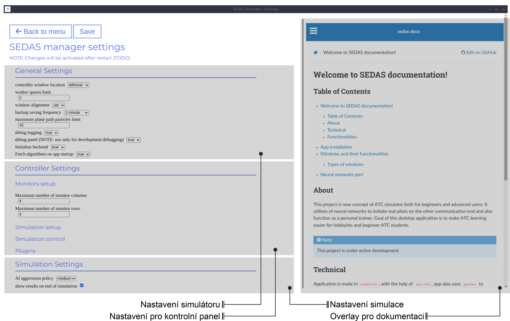
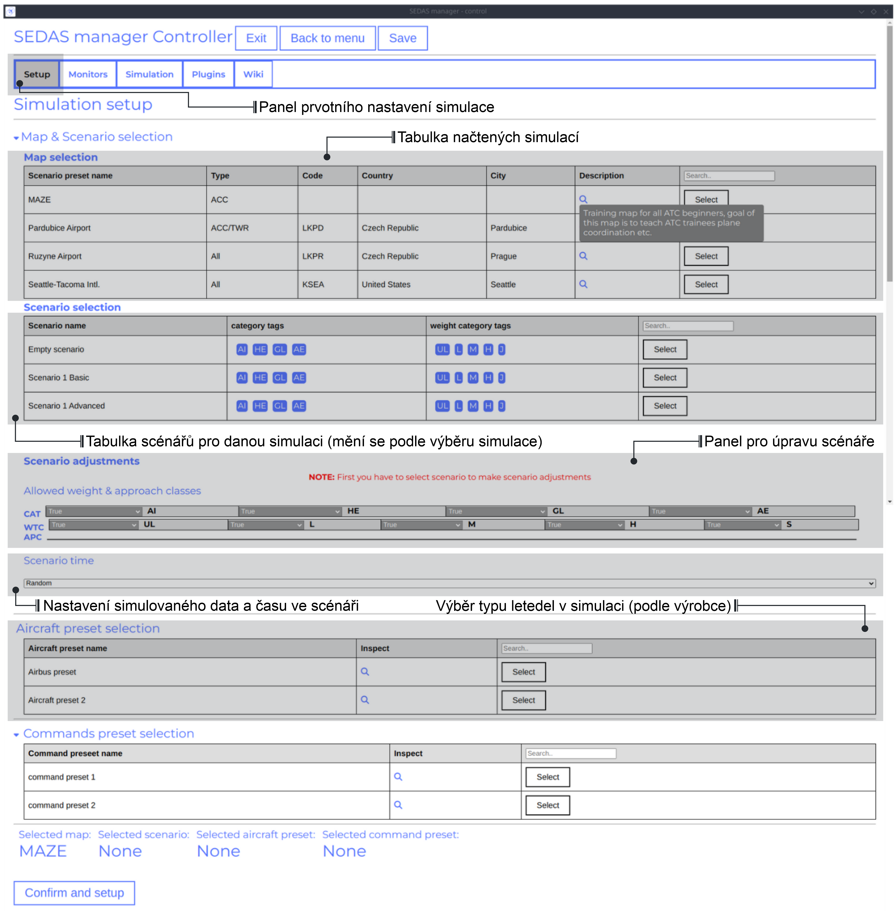
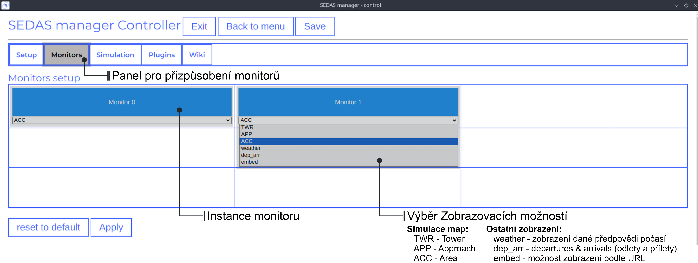
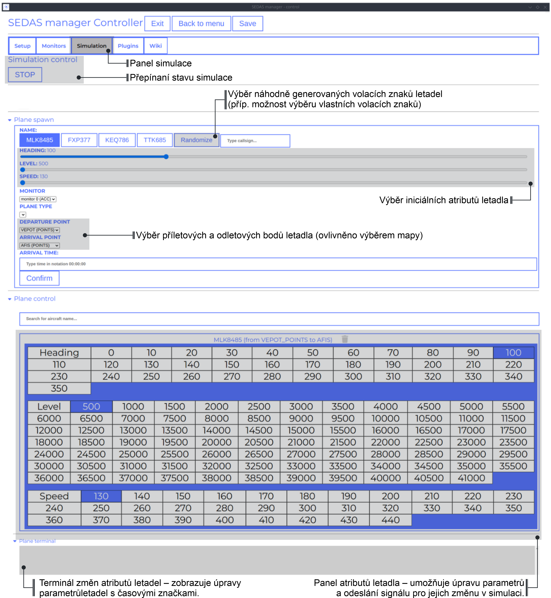
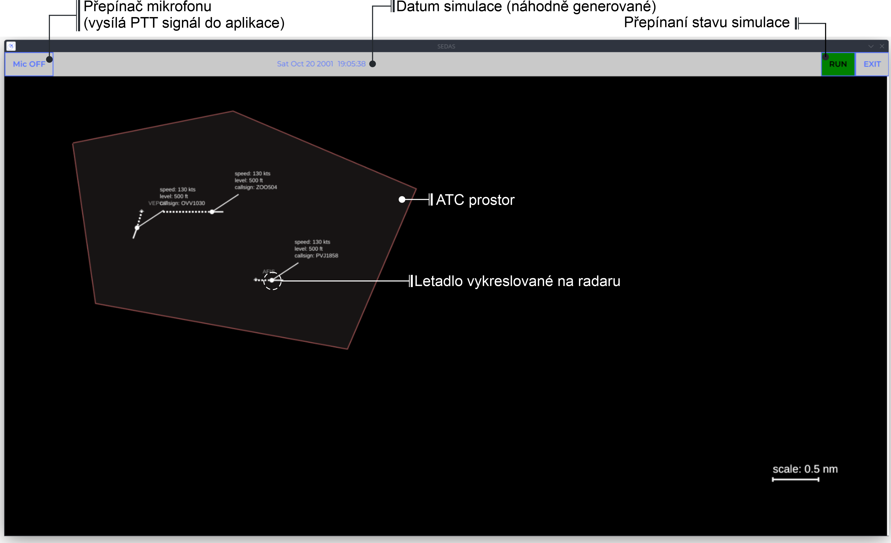

===================================
Uživatelský manuál
===================================

Tento manuál popisuje veškerou interakci uživatele s
Manuál se skládá z **Installace aplikací**, **Typy oken** a všech jejich funkcí
a **Nastavení aplikací** (typy nastavení a jejich účinky na provozní dobu aplikace)

Tabulka obsahů
===================================
#. :ref:`App installation`
#. :ref:`Windows`
#. :ref:`Main menu`
#. :ref:`Settings`
#. :ref:`Controller`
#. :ref:`Worker`
#. :ref:`Modes`
#. :ref:`Configurations`

.. _App installation:

Instalace App
===================================

.. note::

**V současné době projekt nemá žádné stavby**, hlavní desktopová aplikace je nyní v raném vývoji a mnoho funkcí ještě není dokončeno.
Nicméně, brzy budete moci vidět vydání na `SEDAS github vydání <https://github.com/SEDAS-DevTeam/SEDAS-manager/releases>`_.

...
Podporované značky:
HTTPS://img.shields.io/badge/OK-green?style=flat-square = OK - stavět úspěšný
HTTPS://img.shields.io/badge/WARN-žlutý?style=flat-square = WARN - některé problémy mohou být na cestě
HTTPS://img.shields.io/badge/X-red?style=flat-square = X - stavět neúspěšný

.. list-table:: List of supported OSes/distros
:header-rows: 1

* * * * * * * *
* Státní *
* Poznámka *
Zpět na Ubuntu 24.04
- .. image:: https://img.shields.io/badge/X-red?style=flat-square
Uvolnění není k dispozici
Zpět na Ubuntu 22.04
- .. image:: https://img.shields.io/badge/X-red?style=flat-square
Uvolnění není k dispozici
• Arch Linux
- .. image:: https://img.shields.io/badge/X-red?style=flat-square
Uvolnění není k dispozici
• Windows 11
- .. image:: https://img.shields.io/badge/X-red?style=flat-square
Uvolnění není k dispozici
• Windows 10
- .. image:: https://img.shields.io/badge/X-red?style=flat-square
Uvolnění není k dispozici
• MacOS
- .. image:: https://img.shields.io/badge/X-red?style=flat-square
Uvolnění není k dispozici

.. |ok| image:: https://img.shields.io/badge/OK-green?style=flat-square
.. |warn| image:: https://img.shields.io/badge/WARN-yellow?style=flat-square
.. |fail| image:: https://img.shields.io/badge/X-red?style=flat-square

*    - Práce na distro
*Příběh - Některé problémy jsou přítomny
*

.. tabs::

.. tab:: Building locally

.. note::
**Všechny stavební kroky byly testovány pro Linux distros**, takže skutečné stavební pokyny pro Windows by se pravděpodobně významně lišily.

Nastavení pracoviště
„“““““““““““

.. tabs::

.. tab:: Linux
* Připravte si zálohu*

.. code-block:: shell

git clone --recursive https://github.com/SEDAS-DevTeam/SEDAS-manager.git
cd SEDAS-manager

Vytvoření virtuálního prostředí Python**

Doporučuji používat „pyenv“ pro nastavení projektového pomocníka (pro správu stavby, sběr atd.), ale pokud jste více obeznámeni s „conda“, není problém s tím používat.
Všechny závislosti na projektovém pomocníkovi se nacházejí v „requirements.txt“

.. code-block:: shell

pyenv install 3.11 # install python3.11
pyenv virtualenv 3.11 sedas_manager_env
pyenv local sedas_manager_env # Switches to environment
pip install -r requirements.txt # install depedendencies

.. note::
Toto místní nastavení vytvořilo soubor „.python-verze“ ve vašem pracovišti. pomáhá pyenv určit, které virtuální prostředí aktivovat.
Takže v podstatě nemusíte provádět aktivace / deaktivace.

* Vymezení prostředí Node.js*

Tyto projekty používají ``nvm'' (Node Version Manager, `instalace odkaz <https://github.com/nvm-sh/nvm>`_) pro správu verze Node.js, takže projekt může zůstat většinou aktuální.
V současné době projekt používá nejnovější verzi LTS (*v22.14.0*), abyste správně nastavili prostředí, musíte provést následující kroky:

.. code-block:: shell

nvm install # to install LTS version from .nvmrc file
npm install -g npm@latext # ensure the latest version of npm

Node.js prostředí je nyní nastaveno. invoke příkazy automaticky přechází na verzi uvedenou v ``.nvmrc ''.

** Instalace závislostí npm**

.. code-block:: shell

npm install
npm install -g node-gyp # to enable addon compilation

.. note::

**V současné době Ubuntu 24.04 implementoval nové omezení AppImage,** takže uživatelé nemohou spustit aplikace Electron sandboxed (`github vydání <https://github.com/electron/electron/issues/42510>`_).
Dočasná pracovní doba je níže:

.. code-block:: shell

sudo sysctl -w kernel.apparmor_restrict_unprivileged_userns=0 # deactivates the restriction
sudo sysctl -w kernel.apparmor_restrict_unprivileged_userns=1 # activates the restriction

**Zkontrolujte jakékoli aktualizace z podmodulů**

.. code-block:: shell

invoke update # this will also check requirements.txt if any dependency is missing

**Kombinace souborů C++, TS a node-addon-api**

.. code-block:: shell

invoke compile

**Run aplikace v rozvojovém režimu**

.. code-block:: shell

invoke devel

Všechno by mělo být na tuto chvíli připraveno :).

.. tab:: Windows

.. note::
** Přidat Windows stavební pokyny**

.. tab:: MacOS

.. note::
** Přidat pokyny pro MacOS stavět**

Vytvořit a publikovat na GitHub vydání
„“““““““““““

Toolkit umožňuje vývojářům vytvářet a publikovat binární lokálně. Tato funkce je pouze pro uživatele, kteří chtějí přispět a být součástí aktivního rozvoje.
Určitě se v této části budou dělat nějaké změny.

.. code-block:: shell

invoke build # executes app build
invoke publish # executes app publish to github

.. note::
Rozdíl mezi příkazem "publikovat" a "budovat" je v tom, že "publikovat" také publikuje binární na GitHub.

.. note::
**Vydávání nebude fungovat právě teď.** Musíte být oprávněni a mít přístup k organizacím, které nejsou v současné době možné, protože mnoho aspektů bude v budoucnu nutné přehodnotit.

Vytvoření dalších projektů
„“““““““““““

Tato část je zcela volitelná. je to právě tady, aby ukázal lidem, kteří chtějí podílet se na vývoji, jak nastavit další SEDAS sklady také.

.. tabs::

.. tab:: SEDAS-AI-backend

Tento modul je již postaven uvnitř správce SEDAS jako podmodul, takže prakticky není nutné ho postavit sami.
Ale pokud se chcete podílet na vývoji podpory SEDAS-AI, můžete následovat tyto kroky:

* Připravte si zálohu*

.. code-block:: shell

git clone --recursive https://github.com/SEDAS-DevTeam/SEDAS-AI-backend.git
cd SEDAS-AI-backend

Vytvoření virtuálního prostředí Python**

.. code-block:: shell

pyenv install 3.11 # install python3.11
pyenv virtualenv 3.11 sedas_backend_env
pyenv local sedas_backend_env # Switches to environment
pip install -r requirements.txt # install depedendencies

cd src # přepínat na pracovat dir (kde se nachází tasks.py)

**Využití všech zdrojů modelu ASR/TTS**

.. code-block:: shell

invoke fetch-resources

.. note::
**Buďte si vědomi**, že by to pravděpodobně trvalo nějakou dobu. pomocník potřebuje získat ATC-whisper binární z 'huggingface repository <https://huggingface.co/HelloWorld7894/SEDAS-whisper>`_ a také některé TTS binární z Piper webového zdroje.

**Building whisper.cpp závislost**

.. code-block:: shell

invoke build-deps

.. note::
Tento krok by také trval nějaký čas, `whisper.cpp <https://github.com/ggml-org/whisper.cpp>`_ potřebuje vytvořit vápník, který bude vyzývat model ATC-whisper na začátku simulace.
Takže pokud sestavíte verzi CUDA (to je nastaveno dle výchozího nastavení), tento proces pravděpodobně trvá nějakou dobu.

* Budování celého projektu *

* pro testování *

.. code-block:: shell

# for running a test
invoke build --DTESTING=ON
invoke run test

Pro „test“ vykonatelný, můžete ovládat ASR a TTS jednoduše pomocí klávesnice invokes (tj. klíč „a“ pro začátek / zastavení nahrávání a klíč „q“ pro zabíjení celého programu).

* Pro integraci *

.. code-block:: shell

# to test the actual executable that is going to be integrated in SEDAS
invoke build --DTESTING=OFF
invoke run main

Pro „hlavní“ prováděcí, k testování komunikace, musíte spustit další skript na jiném terminálním okně (to je proto, že integrační skript komunikuje pomocí socketové komunikace na konkrétním portu „65 432“).

.. code-block:: shell

invoke test-main # runs the "commander" script that controls the "main" one

.. note::
** Bohužel**, „hlavní“ prováděcí v současné době komunikuje na konkrétním přístavu, který není změněný.
To se určitě v budoucnu změní

Použití „test-main“ scénáře:

.. code-block:: shell

register  [callsign (string)] [noise-intensity (float)] # registers a pseudopilot to communicate with user (write without brackets)

Start-mic # začíná nahrávání mikrofonů
Stop-mic # stops mikro nahrávání

#
# Udělejte zde nějakou komunikaci pomocí start-mic nebo stop-mic
#

Unregister [callsign (string)] # unregister/terminate pseudopilot
ukončit # ukončit hlavní program

.. tab:: ATC-whisper

Tento sklad je v současné době používán pouze pro výzkumné účely, takže je zcela vyloučen z celého potrubí SEDAS-manager.
Normální uživatel ho nepotřebuje postavit, protože sedas automaticky získává odpovídající binary z 'huggingface repository <https://huggingface.co/HelloWorld7894/SEDAS-whisper>`_.
Tak následujte tento repo, pokud se chcete podílet na výzkumu a provádění pro lepší ASR model.

.. note::
**V současné době**, ATC-whisper nepodporuje výcvik vlastní přizpůsobený model whisper, jen realizuje konverzi `whisper-ATC-czech-full <https://huggingface.co/BUT-FIT/whisper-ATC-czech-full>`_ (přizpůsobené váhy) do
model v „GGML“ formátu.Ale v budoucnu bude projekt umožňovat školení přizpůsobených modelů na ATCOSIM a dalších databázích.

* Připravte si zálohu*

.. code-block:: shell

git clone --recursive https://github.com/SEDAS-DevTeam/ATC-whisper.git
cd ATC-whisper

Vytvoření virtuálního prostředí Python**

.. code-block:: shell

conda env create -f environment.yaml
conda activate atc_whisper # use conda deactivate for env deactivation

CD src # dostat do práce dir

**Download zdrojů**

.. code-block:: shell

invoke download
# use: invoke download -t="repo" to download SEDAS-whisper huggingface repo
# use: invoke download -t="model" to download whisper-ATC-czech-full resources

**Build whisper.cpp binary** (pouze pro testování závěry modelu whisper)

.. code-block:: shell

invoke build

.. note::
**Buďte si vědomi**, že to bude trvat nějakou dobu, protože whisper.cpp potřebuje vybudovat celý whisper wrapper binární. proces může být mnohem delší, pokud je vybudován s podporou CUDA (která je nyní dle předvolby).

**Konvertovat Pytorch binární na GGML binární**

.. code-block:: shell

invoke convert bin-to-ggml

* zkušební závěr *

.. code-block:: shell

invoke run-infer

**Ukládání modifikovaného obsahu do Huggingface** (působí pouze pro ověřené uživatele s vlastním tokenem)

Token je uložen na „token.yaml“ v kořenu projektu (musíte ho vytvořit sami), formátování je odpovídající:

.. code-block:: yaml

token: <your huggingface token>

Chcete-li nahrát modifikovaný obsah, spustit tento příkaz:

.. code-block:: shell

invoke upload

.. tab:: sedas-docs

Také není nutné pro stavbu uživatele SEDAS-Manager, ale pokud chcete přispět k projektu **SEDAS**, pokračujte.

* Připravte si zálohu*

.. code-block:: shell

git clone https://github.com/SEDAS-DevTeam/sedas-docs.git
cd sedas-docs

Vytvoření virtuálního prostředí Python**

.. code-block:: shell

pyenv install 3.10 #install python3.10
pyenv virtualenv 3.10 sedas_docs
pyenv local sedas_docs # Switches to environment
pip install -r requirements.txt
pip install -r ./docs/en/requirements.txt # Install the sphinx requirements

*Dokumentace na místní úrovni*

.. code-block:: shell

invoke build en # for the english version (for others, supply other abbreviations: cz)

.. tab:: Downloading/using prebuilt binaries

.. tabs::
.. tab:: Linux

.. note::
Projekt ještě nebyl postaven

.. tab:: Windows

.. note::
Projekt ještě nebyl postaven

.. tab:: MacOS

.. note::
Projekt ještě nebyl postaven

.. _Windows:

Windows a jeho funkce
===================================

Typy oken
-----------------------

V současné době se používají tyto typy oken:

.. _Main menu:

Hlavní menu
„“““““““““““

Na začátku desktopové aplikace je uživatel vítán hlavním menu okna. Tento okno má pouze 3 tlačítka, které přesměrují uživatele
v různých částech aplikace.

* **Start** - Tento tlačítko aktivuje backend SEDAS a další moduly, a také spolu s tím iniciuje všechny okna, které se budou používat (‘Kontrola okna‘, ‚Worker okna‘ (1 .. N - 1), N - definuje číselné monitory připojené)

* * * * * * * * * * * * * * * * * * * * * * * * * * * * * * * * * * * * * * * * * * *

* **Reload last session** - Vzhledem k tomu, že aplikace má funkci pravidelného zálohování, uživatel má možnost obnovit poslední session z posledního zálohování, které je k dispozici.

.. note::
**Reload tlačítko je prozatím vymazáno**, poslední zotavení se zatím neprovádí.

.. _Settings:

nastavení
„“““““““““““

V okně nastavení může uživatel nastavit základní chování simulátoru. samotné okno je rozděleno do několika kategorií. Máme obecné nastavení, které usnadňují
Pak máme nastavení ovládače (tj. chování oken ATCo) a nastavení simulace, které umožňují uživateli změnit některé
Z hlediska životního prostředí a také pseudopilotního chování AI.

.. _Controller:

Kontrolní okno
„“““““““““““

To je nejdůležitější okno v celé aplikaci. kategorizuje uživatelské akce do několika tabulek (Nastavení, Simulace, Wiki, Monitory, Plugins), které jsou vysvětleny níže.
Dokumentace je formátována do různých kategorií, které vysvětlují konkrétní okno.

.. tabs::
.. tab:: Setup tab

Srovnání: Centrum

Ovladač Setup Tab

Simulace SEDAS jsou rozděleny do dvou kategorií: **Planned** a **Unplanned**.

* Plánované simulace *

Uživatel může nastavit plánované simulace v tabulce nastavení, když vyberou mapu (a odpovídající scénář), předem nastavení letadla a předem nastavení příkazů s dodatečnými tweaks.
Po tom simulátor určí a nastaví tak simulace.Varianty, které jsou uživatelem přepínavé, jsou vysvětleny níže:

* **Map** - zde může uživatel vybrat konkrétní mapu / letiště, které bude použito v simulace.Každá mapa má svůj typ podle klasifikace zóny ATC (ACC, TWR a APP).Ty mají také označený kód letiště ICAO (pokud je mapa označena jako letiště), Krajina a Město (může být ponechán prázdný, pokud simulace nebude přesměrován na skutečné místo) a popis (také volitelné).

* * * * * * * * * * * * * * * * * * * * * * * * * * * * * * * * * * * * * * * * * * * * * * * * * * * * * * * * * * * * * * * * * * * * * * * * * * * * * * * * * * * * * * * * * * * * * * * * * * * * * *

* * * * * * * * * * * * * * * * * * * * * * * * * * * * * * * * * * * * * * * * * * * * * * * * * * * * * * * * * * * * * * * * * * * * * * * * * * * * * * * * * * * * * * * *

* * * * * * * * * * * * * * * * * * * * * * * * * * * * * * * * * * * * * * * * * * * * * * * * * * * * * * * * * * * * * * * * * * * * * * * * * * * * * * * * *

* **Přeset letadel** - Umožňuje uživateli vybrat určité typy letadel (plány od jediného výrobce atd.).

* **Připravte příkazy** - Umožňuje uživateli vybrat konkrétní příkazy, které budou povoleny v simulaci.

.. note::
**V současné době plánované simulace zatím nefungují.** To je proto, že implementace simulace nastavení motoru je docela nudné a vyžaduje zavedení mnoha pravidel a výjimek
Při jeho provádění je doporučeno, aby uživatel používal **Neplánované simulace** cestu.

* Neplánované simulace *

Každá mapa umožňuje uživateli nastavit každou předvolbu na prázdnou. To znamená, že simulátor bude nastaven na výchozí a nulové výjimky budou použity na simulace.
Simulace by byla prázdná a zobrazí se pouze vybraná mapa.Po tom, uživatel může volně šroubovat letadla v tabulce **Simulace**, takže simulace je řízen uživatelem.

.. tab:: Monitors tab

Srovnání: Centrum

Ovládání monitorů Tab

Simulátor umožňuje uživateli přizpůsobit několik okenních příkladů. samotná aplikace je navržena tak, aby pracovala na nastavení více monitorů. Doporučený počet monitorů je v současné době 2 (jeden pro kartu Controller, druhý pro kartu Fro Worker (ATCo).
Nicméně, aplikace také pracuje pouze na jednom nastavení monitoru ( okna by se přesto překrývala). Uživatel může vybrat, jaké chování by konkrétní okno / monitor měl.
Možnosti jsou uvedeny níže:

* **TWR** - Tower View pro simulace (Map musí podporovat TWR)

* * * * * * * * * * * * * * * * * * * * * * * * * * * * * * * * * * * * * * * * * * * * * * *

* * * * * * * * * * * * * * * * * * * * * * * * * * * * * * * * * * * * * * * * * * * * * * * * * *

* ** počasí** - Vkládá údaje o počasí do simulace (Mapa musí označit určité místo na Zemi - Země a město značky nemohou být prázdné při výběru)

* **dep_arr** - zobrazení odletu/príchodu pro aktuálně aktivované letadla.

* **embed** - Umožňuje uživateli začlenit externí webový zdroj z URL.

.. note::
Simulátor v současné době podporuje pouze **ACC**, **veather** a **dep_arr** zobrazení.

.. tab:: Simulation tab

Srovnání: Centrum

Ovladač Simulační tab

V tabulce simulace může uživatel ovládat chování simulace. To není opravdu nutné v **Planovaných simulacích**, ale docela důležité v **Neplanovaných simulacích**.
Na vrcholu, uživatel může ovládat stav simulace. Poté máme letadlo spouštěcí část. Tam můžeme nastavit název letadla (náhodně generované nebo vytisknuté) a
počáteční hodnocení, úroveň a rychlost.Můžeme také určit konkrétní odletové a příjezdové body na letadlo.

.. note::
** Možnosti: Typ letadla a Monitor** ještě nejsou funkční. nejsou v nastavení simulace letadla relevantní, takže v budoucnu je buď odstraníme, nebo je provedeme funkčně.

Po potvrzení letadla bude letadlo spouštět na okně ATCo a uvidíme nový panel otevřen v kategorii Ovládání letadla.
Tento panel je určen pouze pro základní opravu, není nutný, protože jeho funkčnost je doplněna pseudopiloty AI (tj. uživatel ovládá všechny variabily letadla verbálně).

Poslední část je terminál letadla. zde může uživatel vidět všechny záznamy o letadlech reagujících na příkazy ATCo a také změny názvu, úrovně a projevu provedené letadlem.

.. tab:: Plugins tab

.. note::
**Plugin GUI ještě není dokončen**, projekt potřebuje nějaký přepracování implementací pluginu.

.. tab:: Wiki tab

.. figure:: imgs/pic/wiki.png
Srovnání: Centrum

Přehrávač Wiki tab

Simulátor je určen pro lidi, kteří jsou začátečníky v ATC. Z tohoto důvodu je okno ovládacího prvku určeno pouze pro dokumentaci.
Uživatel může přepínat mezi **SEDAS** a **IVAO** dokumentací (která také obsahuje zajímavé údaje o ATC).
je spolehlivým zdrojem ATC spravovaným společností EUROCONTROL.

.. _Worker:

Pracovní okno (ATCo)
„“““““““““““

To je GUI, který je viditelný pro ATCo (Aer Traffic Control Officer).
Na vrcholu je topnav, který obsahuje akce ATCo (mikrofonový výstup, datum a čas simulace a simulace stavu přepínání).
Simulátor také umožňuje ATCo k výstupu simulace (tak, že ATCo nemusí vytiahnout myši do odděleného okna, aby se výstup aplikace).
V pravém dolním rohu máme skalu, takže ATCo může udělat některé jako předpoklad o oblasti ATM zóny.

.. _Modes:

Simulační režimy
===================================

V současné době aplikace podporuje dva režimy ATC simulací: **plánované** a **neplánované** simulace.

* * * * * * * * * * * * * * * * * * * * * * * * * * * * * * * * * * * * * * * * * * * * * * * * * * * * * * * * * * * * * * * * * * * * * * * * * * * * * * * * * * * * * * * * * *

* **Neplánované simulace -** Každá mapa podporuje prázdný scénář. Když uživatel vybere tento, zatímco nastavuje i zbytek předvoleb, a stisknutím tlačítka *Přesvědčte se a nastavte*, aplikace nebude zahájit své environmentální manipulaci, protože zjistí, že neexistuje žádný scénář k dispozici. Jediná věc, kterou bude nastaven, je mapa a zbytek předvoleb (letadla, příkazy).

.. note::
**V současné době aplikace podporuje pouze neplánované simulace**, plánovaný mechanismus nastavení simulace je stále v rozvoji.

.. _Configurations:
Uživatelská konfigurace JSON
===================================

Naštěstí uživatelé nepotřebují upravovat samotné konfigurace, pokud nechtějí větší kontrolu nad chováním programů.
Hlavní nastavení aplikace lze změnit prostřednictvím grafického rozhraní nastavení SEDAS, který je přístupný prostřednictvím hlavního menu. Nicméně, tato kapitola popisuje další konfigurace a také nastavení formátování, takže uživatel může ručně zasahovat do funkce aplikace.

.. tabs::
.. tab:: Main settings

.. tab:: Modules

.. tab:: Plugins

.. tab:: GUI layout

.. tabs::
.. tab:: Settings

.. tab:: Plugin

.. tab:: Environments

.. tabs::
.. tab:: Map config

.. note::
Ve výchozím nastavení SEDAS vloží některé mapy v nově nainstalovaném balíčku. Uživatel může přidat vlastní balíček, ale s cílem to udělat,
Musí se manuálně dostat do zdrojů aplikací a přidat odpovídající „json“ soubor sám. V budoucnu bude SEDAS mít integrovaný modul pro tvorbu aplikací (**SEDAS-mapbuilder**).

** Instalace mapy předem manuálně**

**Instalace mapy předem pomocí SEDAS-mapbuilder**

.. tab:: Airline config

.. note::
**Příslušenství letecké společnosti** se zatím v pozadí neprovádí, zatím slouží k žádnému účelu.
Ale tato funkce bude implementována vedle plánovaného algoritmu simulace a nastavení.
V současné době nejsou ani volitelné v tabulce *Nastavení*, protože provozovatel prostředí ještě není dokončen, a proto by v podstatě sloužil jako žádný účel.

.. tab:: Command config

.. note::
**Příslušenství pro příkaz** se zatím v pozadí neprovádí, zatím slouží k žádnému účelu.
Ale tato funkce bude implementována vedle plánovaného algoritmu simulace a nastavení.

.. tab:: Planes config

.. note::
**Planové předměty** nejsou v pozadí dodnes implementovány, zatím slouží k žádnému účelu.
Ale tato funkce bude implementována vedle plánovaného algoritmu simulace a nastavení.
K dnešnímu dni celá simulace vypočítá leteckou fyziku na základě letadla B737-800 (viz :doc:`teorie` pro více informací).

.. note::
**Moduly a pluginy mají také své vlastní konfigurace, ale jsou spravovány samotným modulem/pluginem.
Celý panel konfigurace modulů/pluginů bude k dispozici v následující verzi SEDAS.
