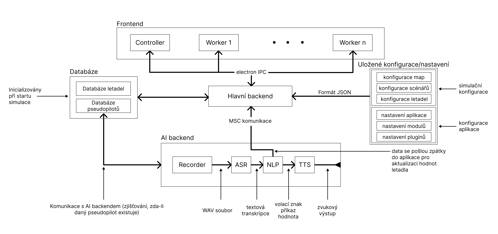
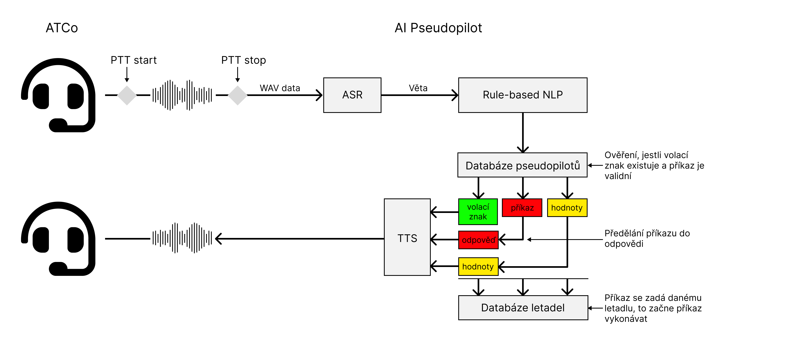

===================
Technické aspekty aplikace
===================

Obsah
===================================
#. :ref:`Pouzite technologie`
#. :ref:`Schema aplikace`
#. :ref:`Neuronove site`
#. :ref:`Vypocty`

.. _Pouzite technologie:
Použité technologie
===================

Aplikace využívá mnoho technologií k implementaci svých částí. Například využívá komunikaci pomocí localhost socketů pro komunikaci mezi hlavní aplikací a modulem umělé inteligence. Tato stránka se pokusí vysv vysvětlit všechny technické postupy použité při vývoji.

.. list-table:: Seznam použitých technologií
   :widths: 40 60
   
   * - **Použitá technologie**
     - **Vysvětlení**
   * - **Aplikace**
     -
   * - ``ElectronJS``
     - Hlavní backend pro chování aplikace
   * - ``NodeJS``
     - Hlavní aplikační runtime
   * - ``Typescript``
     - Jazyk použitý pro backend
   * - ``node-addon-api/C++``
     - Použito pro výpočetně náročné operace
   * - **AI modul**
     -
   * - ``Whisper``
     - ASR
   * - ``Rule-based NLP (regex, if-else)``
     - NLP 
   * - ``VITS``
     - TTS
   * - ``Whisper.cpp``
     - Inferenční systém pro model Whisper
   * - ``PiperTTS``
     - Inferenční systém pro model VITS

\* **ASR** - Automatické rozpoznání řeči

\* **NLP** - Zpracování přirozeného jazyka

\* **TTS** - Syntéza řeči

.. _Schema aplikace:
Schéma aplikace
===================

Aplikace je rozdělena do několika modulů, které jsou propojeny různými komunikačními mechanismy:

* **IPC** (**I**\ nter **P**\ rocess **C**\ ommunication) - Protokol pro komunikaci mezi frontendem a backendem. Umožňuje aplikaci odesílat signály backendu při akcích uživatele a naopak.

* **Worker threads** - Umožňují aplikaci využít neblokující architekturu. Používají se hlavně pro činnosti, jako je správa času simulace nebo ukládání záloh.

* **MSC** (**M**\ odule **S**\ ocket **C**\ ommunication) - Protokol implementovaný pro komunikaci mezi moduly aplikace a hlavním backendem. Většina modulů je napsána v C++ a jsou navrženy k nezávislému spouštění. Motivací pro toto uspořádání bylo možnost testovat moduly zvlášť od samotné aplikace (``CMake`` konfigurace + ``invoke`` knihovna) a aby také umožnily aplikaci běžet hladce bez blokování.

.. _Neuronove site:
Neuronové sítě
===================

Modul umělé inteligence má odpovídající strukturu. Máme signál **PTT** (**P**\ ush **T**\ o **T**\ alk), který je vyvolán v grafickém uživatelském rozhraní ATCo. Ten signalizuje zahájení hlasového záznamu ATCo. Pomocí dalšího signálu **PTT** zastavíme nahrávání hlasu, který je následně převeden do formátu ``Wavefile``, který je poté odeslán do modelu ASR (Whisper).
Surový přepis je poté programově zpracován (zbaven časových značek atd.) a následně odeslán do mechanismu NLP založeného na pravidlech. Tento mechanismus z přepisu oddělil ``callsign``, ``command`` a ``value``. Poté zkontrolujeme ``callsign`` s databází pseudopilotů (tj. zda konkrétní pseudopilot existuje). Pokud ano, pošleme do databáze letadel signál o změně kurzu podle ``příkazu`` a ``hodnoty``. Poté pseudopilot vygeneruje odpověď, která je následně odeslána do modelu TTS, který vygeneruje soubor s vlnou. Tento wavefile je pak přehráván pomocí systémového přehrávače.

.. note::
   **Systém aktuálně podporuje pouze zvukový systém Pipewire**. Podpora pro jiné platformy je ve vývoji.
   `Github issue <https://github.com/SEDAS-DevTeam/SEDAS-AI-backend/issues/5>`_.

.. _Vypocty:
Výpočty letadel a prostředí
===================

.. note::
  **Přidej podrobnější vysvětlení výpočetních metod.**

