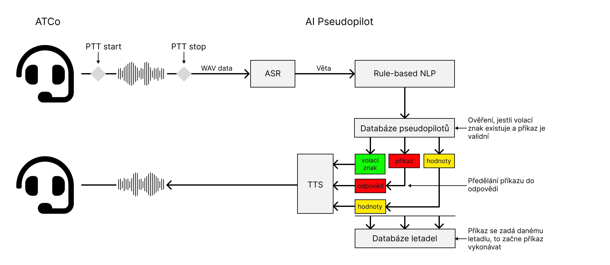

===================================
Technical background
===================================

.. toctree::
   :maxdepth: 2
   :hidden:

Table of contents
===================================
#. :ref:`Technologies`
#. :ref:`Project`
#. :ref:`Schematic`
#. :ref:`Neural networks`
#. :ref:`Calculations`

.. _Technologies:
Used technologies
===================================

Application itself uses a lot of technologies to implement many of its parts. For example it utilises localhost sockets communication for the communication between main app and AI module. This page will try to explain all the technical approaches that were used in the development.

.. list-table:: List of used technologies
   :widths: 40 60
   
   * - **Used tech**
     - **Explanation**
   * - **App**
     - 
   * - ``ElectronJS``
     - Main backend for app behavior
   * - ``NodeJS``
     - Main code runtime
   * - ``Typescript``
     - Language used for backend
   * - ``node-addon-api/C++``
     - Used for resource intensive computations
   * - **AI module**
     - 
   * - ``Whisper``
     - ASR \*
   * - ``Rule-based NLP (regex, if-else)``
     - NLP \*
   * - ``VITS``
     - TTS \*
   * - ``Whisper.cpp``
     - Inference for Whisper model
   * - ``PiperTTS``
     - Inference for VITS model

\* **ASR** - Automatic Speech Recognition

\* **NLP** - Natural Language Processing

\* **TTS** - Text To Speech synthesis

.. _Project:
Project schematic
============

Project itself is divided into several branches and structures, so that the it would be modular and easy to expand. 
It currently uses many technologies/providers for the documentation and versioning, for example: **Huggingface** (Repository for SEDAS-whisper model weights, `link <https://huggingface.co/HelloWorld7894/SEDAS-whisper>`_), **Github** (Repositories and organisational page for the whole SEDAS ecosystem `link <https://github.com/SEDAS-DevTeam>`_), **ReadTheDocs** (Hosting the documentation for the whole project).
The whole code is 100% open-source and every part of it is available on the Github organisation page. All the major subprojects of this ecosystem are arranged below.

  Major SEDAS projects and their licenses

.. _Schematic:
App schematic
============

.. image:: imgs/schema/backend_structure.png

App itself is divided into several modules, that are connected together using several communication mechanismus (See below):

* **IPC** (**I**\ nter **P**\ rocess **C**\ ommunication) - A protocol for the communication between frontend and backend. This is a very important communication mechanism, because it allows app to send signals to backend when they are triggered in user GUI and vice versa.

* **Worker threads** - This allows app to utilize its nonblocking architecture. These are primarily implemented in simulation time management, backup saving. Primarily this is used in methods, that could potentialy take a lot of time and block the app from responding properly.

* **MSC** (**M**\ odule **S**\ ocket **C**\ ommunication) - A protocol that is implemented in the communication between app modules and main backend. Most of the modules are written in C++ and are programmed to be running independently. The motivation to make modules behave like this, was to make module testing easier (``CMake`` configurations + ``invoke`` library) and also allowing app to run smoothly without the module blocking.

.. _Neural networks:
Neural networks
=============

AI module is structured accordingly. We have to **PTT** (**P**\ ush **T**\ o **T**\ alk) signal, that is invoked on the ATCo GUI. This signals the start of the ATCo voice recording. Using another **PTT** signal, we stop the voice from recording, which is then converted to ``Wavefile`` format that is then sent to the ASR model (Whisper).
The raw transcription is then programmaticaly processed (getting rid of timestamps, etc.) and then sent to the Rule-based NLP mechanism. This mechanism separated ``callsign``, ``command`` and ``value`` from the transcription. We then check the ``callsign`` with the pseudopilot database (i. e. if specific pseudopilot exists). If yes, whe then send a signal change to the plane database to set new heading according to ``command`` and ``value``. After that, pseudopilot generates a response that is then sent to TTS model that generates a wavefile. That wavefile is then played using the system player.

.. note::
   **System currently supports only the Pipewire audio system**. Unfortunately, porting to generic 
   audio system that could be cross platform is still in development.
   `Github issue <https://github.com/SEDAS-DevTeam/SEDAS-AI-backend/issues/5>`_.

.. _Calculations:
Plane/Environment calculations
=============

.. note::
  **Add some explanation**