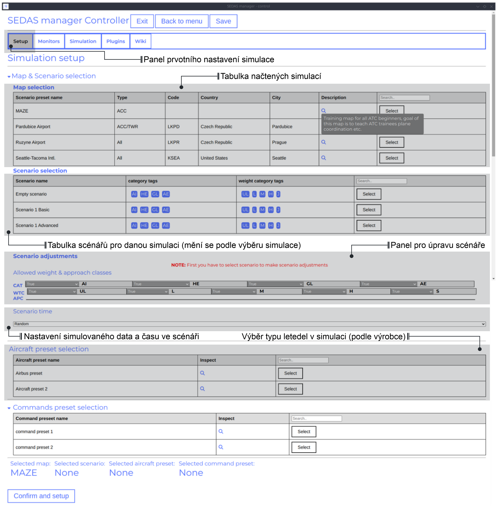
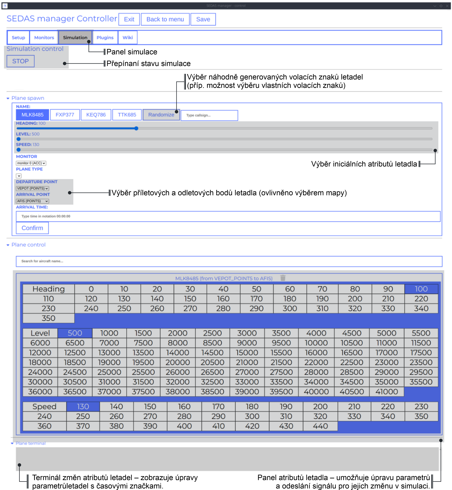
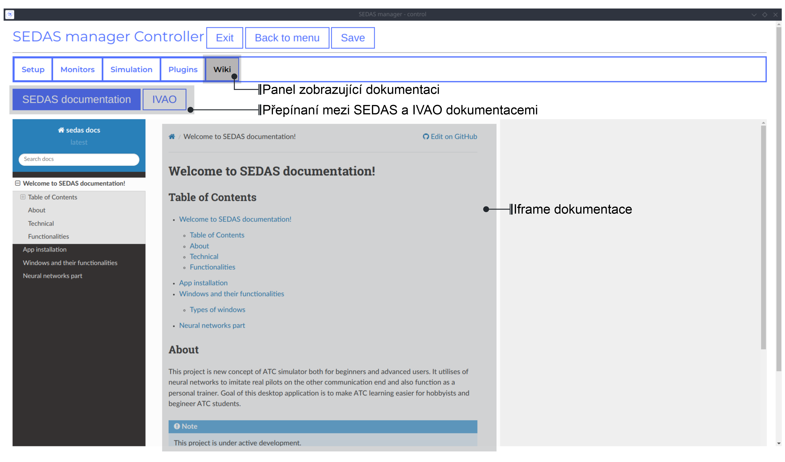
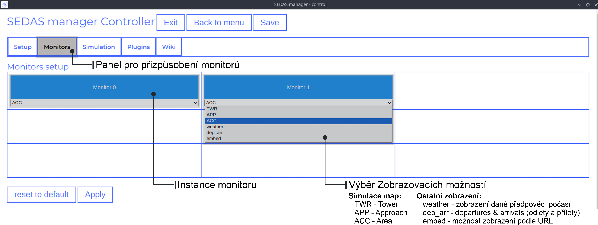

===================================
User manual
===================================

This manual depicts all the user interaction with the
desktop app itself. Manual consists of **App installation**, **Types of windows** and all their functionalities
and **App settings** (types of settings and their effects on the application runtime)

Table of contents
===================================
#. :ref:`App installation`
#. :ref:`Windows`

.. _App installation:
App installataion
===================================

.. note::

   **Currently, project does not have any builds**, the main desktop app is now in early development and many features are not done yet.
   However, you'll soon be able to see releases at `SEDAS github Releases <https://github.com/SEDAS-DevTeam/SEDAS-manager/releases>`_.

Building locally
-----------------------

.. note::
    **All the build steps were tested for Linux distros**, so the actual build instructions for Windows would probably differ significantly.

Setting up repository
""""""""""""""

.. code:: shell
    git clone --recursive https://github.com/SEDAS-DevTeam/SEDAS-manager.git
    cd SEDAS-manager

Setting up virtual environment
""""""""""""""

I recommend using `virtualenv` for setting up project helper (for managing building, compiling, etc.), but if you are more familiar with `conda`, there is no problem of using that.
All the project helper dependencies are in `requirements.txt`

.. code:: shell
    virtualenv sedas_manager_env
    source sedas_manager_env/bin/activate # To activate venv, use "deactivate" for deactivation
    pip install -r requirements.txt
    cd src # get to working dir

Install npm dependencies
""""""""""""""

.. code:: shell
    npm install

Compile C++, TS and node-addon-api files
""""""""""""""

.. code:: shell
    invoke compile

Run app in development mode
""""""""""""""

.. code:: shell
    invoke devel

Everything should be set up for now :).

Building and publishing
""""""""""""""

.. note::
    **These methods arent set up yet**, but will be worked on in the future, because they are quite crucial for the app development.
    Commands down here are mostly placeholders, so please, do not **USE THEM YET**.

.. code:: shell
    invoke build # executes app build
    invoke publish # executes app publish to github

Downloading/using prebuilt binaries
-----------------------

Windows
^^^^^^^^^^^^^^

.. note::
    Project is not built yet

Linux
^^^^^^^^^^^^^^

.. note::
    Project is not built yet

MacOS
^^^^^^^^^^^^^^

.. note::
    Project is not built yet

.. _Windows:
Windows and their functionalities
===================================

Types of windows
-----------------------

Currently, these types of windows are utilized:

.. _Main menu:
Main menu
^^^^^^^^^^^^^^^^^^^^^^^

In the start of the desktop app, user is greeted with the main menu window. This window just has 3 buttons, that redirect user
to different parts of the app.

* **Start** - This button activates SEDAS backend and other modules, and also alongside with that initializes all the windows that are going to be used (`Controller window`, `Worker windows` (1 .. N - 1), N - defines number monitors connected)

* **Settings** - Redirects user to the settings window

* **Reload last session** - Because app has the periodical backup save functionality, user has the ability to recover last session from the last backup that is available.

.. note::
    **Reload button is greyed out for now**, the last session recovery is not yet implemented.

.. _Settings:
Settings
^^^^^^^^^^^^^^^^^^^^^^^

.. image:: imgs/pic/settings.png

.. _Controller:
Controller window
^^^^^^^^^^^^^^^^^^^^^^^

This is the most important window in the whole app. It categorizes user actions into multiple tabs (Setup, Simulation, Wiki, Monitors, Plugins) that are explained below.

Controller Setup
""""""""""""""""""

Controller Simulation
""""""""""""""""""

Controller Wiki
""""""""""""""""""

Controller Monitors
""""""""""""""""""

Controller Plugins
""""""""""""""""""

.. note::
    **The plugin GUI is not done yet**, project needs some reworking of the plugin implementations.

.. _Controller:
Worker (ATCo) window
^^^^^^^^^^^^^^^^^^^^^^^

.. image:: imgs/pic/worker.png

.. _App settings:
App settings
===================================

