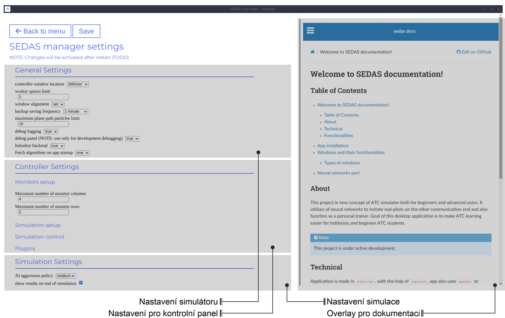
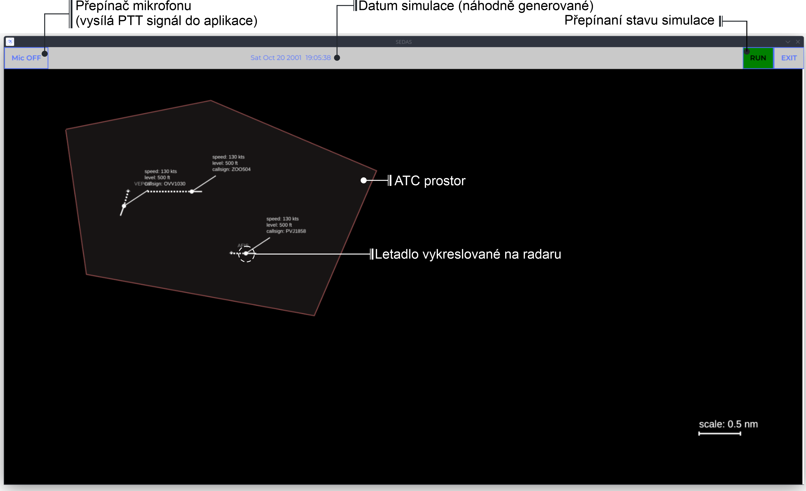

===================================
User manual
===================================

This manual depicts all the user interaction with the
desktop app itself. Manual consists of **App installation**, **Types of windows** and all their functionalities
and **App settings** (types of settings and their effects on the application runtime)

Table of contents
===================================
#. :ref:`App installation`
    #. :ref:`Build locally`
    #. :ref:`Prebuilt`
#. :ref:`Windows`
    #. :ref:`Main menu`
    #. :ref:`Settings`
    #. :ref:`Controller`
    #. :ref:`Worker`
#. :ref:`Configurations`

.. _App installation:

App installataion
===================================

.. note::

   **Currently, project does not have any builds**, the main desktop app is now in early development and many features are not done yet.
   However, you'll soon be able to see releases at `SEDAS github Releases <https://github.com/SEDAS-DevTeam/SEDAS-manager/releases>`_.

.. _Build locally:

Building locally
-----------------------

.. note::
    **All the build steps were tested for Linux distros**, so the actual build instructions for Windows would probably differ significantly.

.. tabs::

    .. tab:: Linux
        **Setting up repository**

        .. code-block:: shell

            git clone --recursive https://github.com/SEDAS-DevTeam/SEDAS-manager.git
            cd SEDAS-manager

        **Setting up virtual environment**

        I recommend using `virtualenv` for setting up project helper (for managing building, compiling, etc.), but if you are more familiar with `conda`, there is no problem of using that.
        All the project helper dependencies are in `requirements.txt`

        .. code-block:: shell

            virtualenv sedas_manager_env
            source sedas_manager_env/bin/activate # To activate venv, use "deactivate" for deactivation
            pip install -r requirements.txt

        .. note::
            **In order for this project to work you need to have Node.js runtime installed.** I recommend using ``nvm`` (node version manager) to manage Node.js versions you installed (`nvm installation <https://github.com/nvm-sh/nvm>`_).

        **Install npm dependencies**

        .. code-block:: shell

            npm install
            npm install -g node-gyp # to enable addon compilation
        
        .. note::
            **Currently, Ubuntu 24.04 implemented the new AppImage restrictions,** so that user cannot run electron apps sandboxed (`github issue <https://github.com/electron/electron/issues/42510>`_).
            The temporary workaround is below:

            .. code-block:: shell
                sudo sysctl -w kernel.apparmor_restrict_unprivileged_userns=0 # deactivates the restriction
                sudo sysctl -w kernel.apparmor_restrict_unprivileged_userns=1 # activates the restriction

        **Compile C++, TS and node-addon-api files**

        .. code-block:: shell

            invoke compile

        **Run app in development mode**

        .. code-block:: shell

            invoke devel

        Everything should be set up for now :).


    .. tab:: Windows

        .. note::
            **Add windows build instructions**

    .. tab:: MacOS

        .. note::
            **Add MacOS build instructions**

Building and Publishing to github releases
-----------------------

Toolkit enables developer to build and publish a binary locally. This feature is only for users who want to contribute and be part of the active development.
So there are definitely going to be some changes regarding this part.

.. code-block:: shell

    invoke build # executes app build
    invoke publish # executes app publish to github

.. note::
    Difference between ``publish`` and ``build`` commands is that ``publish`` also publishes the binary to Github. So you dont need to run ``build`` before publishing.

.. note::
    **The publishing wont work right now.** You would need to be authorized and have access to the organizations which is not possible for now because many aspects needs to be tweaked in the future.

.. _Prebuilt:

Downloading/using prebuilt binaries
-----------------------

.. tabs::
    .. tab:: Linux
        
        .. note::
            Project is not built yet
    
    .. tab:: Windows

        .. note::
            Project is not built yet
    
    .. tab:: MacOS

        .. note::
            Project is not built yet

.. _Windows:

Windows and their functionalities
===================================

Types of windows
-----------------------

Currently, these types of windows are utilized:

.. _Main menu:

Main menu
""""""""""""""""""

In the start of the desktop app, user is greeted with the main menu window. This window just has 3 buttons, that redirect user
to different parts of the app.

* **Start** - This button activates SEDAS backend and other modules, and also alongside with that initializes all the windows that are going to be used (`Controller window`, `Worker windows` (1 .. N - 1), N - defines number monitors connected)

* **Settings** - Redirects user to the settings window

* **Reload last session** - Because app has the periodical backup save functionality, user has the ability to recover last session from the last backup that is available.


.. note::
    **Reload button is greyed out for now**, the last session recovery is not yet implemented.

.. _Settings:

Settings
""""""""""""""""""



In the settings window, user can set up the basic simulator behavior. The window itself is separated into multiple categories. We have the general settings, which facilitate
the general ATC simulator behavior. Then we have the Controller settings (i. e. the behavior of the ATCo windows) and the Simulation settings, which allow user to change some
environmental aspects and also AI pseudopilot behavior.

.. _Controller:

Controller window
""""""""""""""""""

This is the most important window in the whole app. It categorizes user actions into multiple tabs (Setup, Simulation, Wiki, Monitors, Plugins) that are explained below.
The documentation is formatted into different categories that explain specific window. Category order is similar to the order in Controller window.

.. tabs::
    .. tab:: Setup tab
        
        .. figure:: imgs/pic/controller_setup.png
            :align: center

            Controller Setup tab

        The SEDAS simulations are divided into two categories: **Planned** and **Unplanned**. 
        
        **Planned simulations**

        User can set up the planned simulations in the Setup tab, when they select Map (and corresponding scenario), Aircraft preset and Commands preset with aditional tweaks. 
        After that, the simulation engine will determine and setup the simulation accordingly. Variables, that are tweakable by user, are explained below:

        * **Map** - here, user can select a specific map/airport that will be used in the simulation. Every map has its type according to ATC zone classification (ACC, TWR and APP). They also have designated ICAO airport code (if the map is designated as an airport), Country and City (could be left empty if the simulation doesnt redirect to actual place) and the description (also optional).
        
        * **Scenario** - Every map has its own predefined sets of scenarios, that define what plane types are going to be used in the simulation and also other key aspects (time of plane spawning, special situations). Every map has different scenarios.
        
        * **Scenario adjustment** - User can adjust selected scenarios. Currently, scenario adjustments just allow to exclude WTC (Wake Turbulence - **UL**\ tralight, **L**\ ight, **M**\ edium, **H**\ eavy, **J** - Super) or CAT (aircraft category - **AI**\ rplane, **HE**\ licopter, **GL**\ ider, **AE**\ rostat) categories.
        
        * **Scenario time** - User can select the time of scenario (this setting is just aesthetic, so it could be left at random, which generates random time and date)
        
        * **Aircraft preset** - Allows user to select specific types of planes (planes from only one manufacturer, etc.). User can inspect the preset before selecting it.
        
        * **Commands preset** - Allows user to select specific commands that are going to be allowed in the simulation. Other commands are not going to be accepted by AI pseudopilots.

        .. note::
            **Currently, the planned simulations are not working yet.** This is because the implementation of the simulation setup engine is quite tedious and requires to set up a lot of rules and exceptions
            when implementing it. It is advised for the user to use **Unplanned simulations** path.
        
        **Unplanned simulations**

        Every map allows user to set every preset to empty. That means, that the simulation engine will be set to default and zero exceptions will be enforced upon the simulation.
        The simulation would be empty and only the selected map would be rendered. After that, user can freely spawn planes in the **Simulation tab**, so the simulation is directed by the user.
    
    .. tab:: Monitors tab

        .. figure:: imgs/pic/monitors.png
            :align: center
            
            Controller Monitors tab

        Simulator alows user to adjust multiple window instances. The app itself is designed to be working on multiple-monitor setup. The advised number of monitors is currently 2 (one for Controller tab, other fro Worker (ATCo) tab).
        However, app also works on just one monitor setup (the windows would be overlapping though). User can select what behavior could the specific window/monitor have.
        Options are listed below:

        * **TWR** - Tower view for the simulation (Map has to support TWR)
        
        * **APP** - Approach view for the simulation (Map has to support APP)
        
        * **ACC** - Area control view for the simulation (Map has to support ACC)
        
        * **weather** - Embeds weather data into simulation (Map has to point into specific place on the earth - Country and City tags cannot be empty when selected)
        
        * **dep_arr** - Departure/Arrival view for the currently activated planes.
        
        * **embed** - Allows user to embed external web resource from the URL.

        .. note::
            The configurations are not done yet. Simulator currently supports only **ACC**, **weather** and **dep_arr** view.
    
    .. tab:: Simulation tab

        .. figure:: imgs/pic/controller_sim.png
            :align: center

            Controller Simulation tab

        In the simulation tab, user can control the simulation behavior. This is not really needed in **Planned simulations** but quite crucial in the **Unplanned simulations**.
        At the top, user can control simulation state. Then we have the plane spawning part. There we can set the plane name (random generated or typed) and
        initial heading, level and speed. We can also designate specific departure and arrival points to the plane.

        .. note::
            **Options: Plane type and Monitor** are not functional yet. They did not present any kind of relevance in the plane simulation setting, so in the future we either remove them or make them functional.

        After confirming a plane, the plane will spawn on ATCo window and we will see a new panel opened at the Plane control category. Here, user can control the values of the plane (heading, level and speed).
        This panel is just for basic correction, it is not needed because its functionality is supplemented by AI pseudopilots (i. e. user controls all the plane variables verbally).

        The last part is the plane terminal. Here, user can see all the logs about planes responding to ATCo commands and also heading, level and speech changes made by the plane.

    .. tab:: Plugins tab

        .. note::
            **The plugin GUI is not done yet**, project needs some reworking of the plugin implementations.

    .. tab:: Wiki tab

        .. figure:: imgs/pic/wiki.png
            :align: center

            Controller Wiki tab

        Simulator is designed for people who are beginners in ATC. Because of that, the Controller window has designated tab only for the documentation.
        User can switch between **SEDAS** and **IVAO** documentation (which also contains interesting data regarding the ATC). There is also a hyperlink to **Skybrary** at the bottom of the page,
        which is a reliable ATC source managed by EUROCONTROL.

.. _Worker:

Worker (ATCo) window
""""""""""""""""""



This is the GUI that is visible for the ATCo (Air traffic control officer). The overlay is partly inspired from other simulators as well.
On the top is the topnav that contains ATCo actions (microphone output toggle, Date and time of simulation and simulation state switching).
Simulator also allows ATCo to exit simulations (so that ATCo doesnt have to drag their mouse to separate window in order to exit app).
On the bottom right corner we have the scale, so that ATCo can make some as assumption about the area of the ATM zone. Planes also have dotted paths that indicate their previous location.

.. _Configurations:
User-manageable JSON configurations
===================================

.. note::
    **TODO**, add something here

For ACC
-----------------------

```
TYPE: "ACC" //specify Controller type
//Areodrome Reference Point, used to locate where Airport is until aircraft control is passsed to APP or TWR
ARP: "none" |
{x: "int value x 1", y: "int value y 1", name: "Airport callsign 1"}
{x: "int value x 2", y: "int value y 2", name: "Airport callsign 2"}
//{} brackets indicate one ARP record
POINTS: 
{x: "int value x 1", y: "int value y 1", name: "Point (route) callsign 1"}
{x: "int value x 2", y: "int value y 2", name: "Point (route) callsign 2"}
//{} brackets indicate one Point record
//Standart Instrument Departure points (not connected by lines)
SID: "none" |
{x: "int value x 1", y: "int value y 1", name: "SID callsign 1"}
{x: "int value x 2", y: "int value y 2", name: "SID callsign 2"}
//{} brackets indicate one SID record
//Standart Arrival Route points (connected by lines)
STAR: "none" |
{x: "int value x 1", y: "int value y 1", name: "STAR callsign 1"}
{x: "int value x 2", y: "int value y 2", name: "STAR callsign 2"}
//{} brackets indicate one STAR record
SECTOR: //a FIR sector where an ATCO will operate, is defined by unlimited set of points (n-gon)
{x: "int value x 1", y: "int value y 1"}
{x: "int value x 2", y: "int value y 2"}
{x: "int value x 3", y: "int value y 3"}
{x: "int value x 4", y: "int value y 4"}
//{} brackets indicate one corner of resulting shape
```

.. note::
    **TODO:** organize